.. title

#########################
leverage software toolkit
#########################

.. subtitle
 ***************
 subtitle
 ***************

:Author: |aw_name|
:Contact: |aw_email|
:date: |date|

.. 
 :revision: 

.. :backlinks:"entry" or "top" or "none"
 .. section-numbering::
   :depth: 6
   :start: 1
   :prefix:
   :suffix:

.. contents:: contents
   :depth: 6
   :backlinks: entry
   :local:

.. |date| date::
.. |aw_email| replace:: hwang04@lear.com
.. |aw_name| replace:: Annie Wang

.. .. default-role:: superscript

why need software toolkit?
==========================

blackboard vs software

+----------------+------------+------------------------------+
| compare items  | blackboard | software                     |
+================+============+==============================+
| space adjusted | can't      | can adjust automatically     |
+----------------+------------+------------------------------+
| export ability | can't      | can export other file easily |
+----------------+------------+------------------------------+
| share          | not easy   | easy                         |
+----------------+------------+------------------------------+

we can leverage the power of software to make the cause and effect analysis more effectively and more conveniently.

recommended software toolkit
============================

- xmind
  
  <https://www.xmind.cn/>

  it is a mind manager software. the fishbone diagram function is excellent.

  |xmind-all|

- visual-paradigm
  
  <https://www.visual-paradigm.com/>

  this is a big software. you can find many of useful and exciting function. fishbone diagram is just a little and little function.

  |vp01-whole|

  some useful marketing tool:

  - Strategic analysis tool
  - SWOT analysis
  - Value chain analysis
  - Competitor analysis
  - Root cause analysis
  - PEST analysis
  - Five Forces analysis
  - Four Corners analysis

toolkit intro: xmind
--------------------

where to get?
^^^^^^^^^^^^^

here is `download website <https://www.xmind.cn/download/>`__

but fishbone diagram is disable with default, you need to pay for becoming professional version.

how to install?
^^^^^^^^^^^^^^^

1. install 
2. activate it to become prefessinal version with full fucntion
   
   help->license, input serial Number to activate.

how to use?
^^^^^^^^^^^^^

1. create new file bone.
   
   file->new, to create a new map, select fishbone(right Headed),then will see following dialog window to choose a theme of fishbone diagram. 

   |xmind_img_01-create|

   ok, then you will have one empty fishbone diagram just a empty head.

#. insert subbone on main bone
   mouse right click on head of fish, then will pop up context menu as following, 

   |xmind_img_02-insertTopic|

   select as menu with a red rectangle. click and click, two subbone will be on main bone.                  

   |xmind_img_03-insertTopic|

#. create sub-subone on subbone
   right mouse click on subbone, will pop context menu

   |xmind_img_04-insertSUBTopicMenu|            
           

   then select as menu with a red rectangle, will create sub-subone.       

   |xmind_img_05-insertSUBTopicRsult|           

#. repeat and create more subsubbones

   |xmind_img_06-all|                         

#. export the causes data to exel table.
   file->export 
   pop up export diaglogue windown.

   |xmind_img_07-01-exporter-optionDialogue|    

   select microsoft exel

   |xmind_img_07-02-exporter-optionDialogue|    

   |xmind_img_07-03-exporter-optionDialogue|    

#. open export excel file
   
   as following:

   |xmind_img_08-01-exporter-pure|              

#. edit excel file by adding priority and task owner
   
   |xmind_img_08-02-exporter-taskowner-priority|

ok, issue tracking table is there.

toolkit intro: visual-paradigm
------------------------------

where to get?
^^^^^^^^^^^^^

here to `download visual-paradigm <https://www.visual-paradigm.com/download/>`__

- standard version
  
  No risk. No obligation. No registration. 30-day FREE Trial.

- Community Edition
  
  all is free just for personal. but when export file or picture, there is watermark on there.

how to install?
^^^^^^^^^^^^^^^

after download please do as following diagram illustration:

#. see follwing
   
   |vpi1_StartVPCE|

#. see follwing

   |vpi2_GetActivationCode|

#. see follwing

   |vpi3_ClickActivate|

#. see follwing

   |vpi4_InputActivationCode|

#. see follwing

   |vpi5_ClickStart|

how to use?
^^^^^^^^^^^^^

please refer to following animation:

|vp02-howtodo|

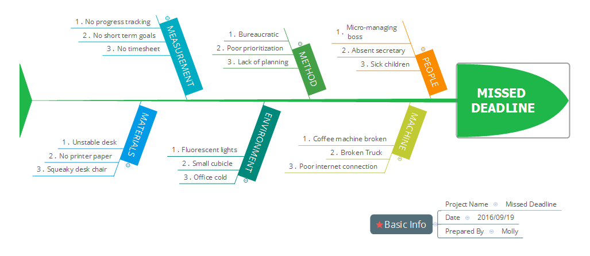

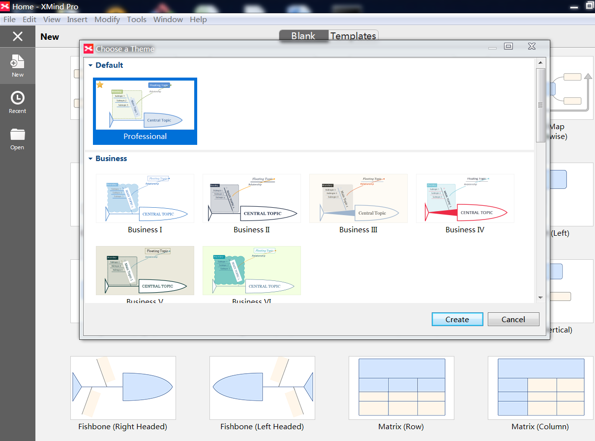
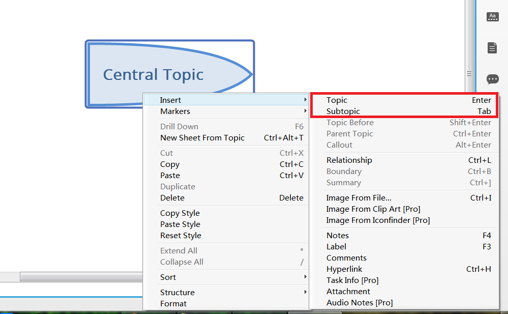
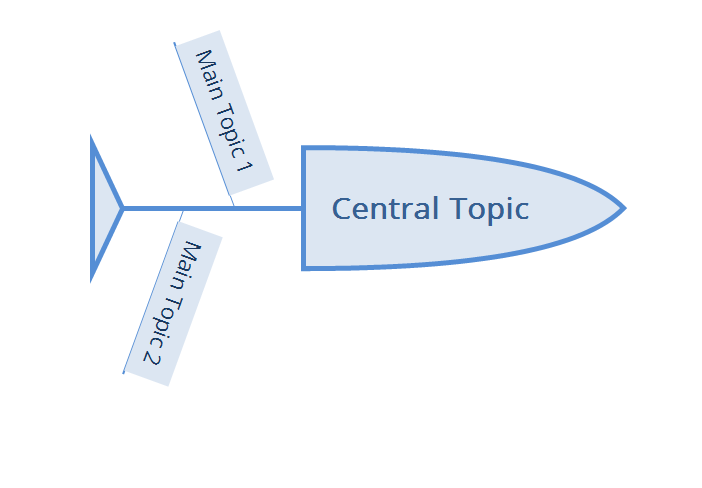
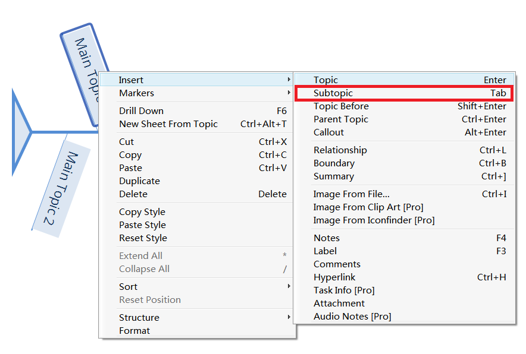
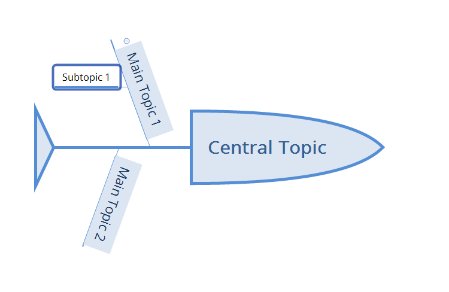
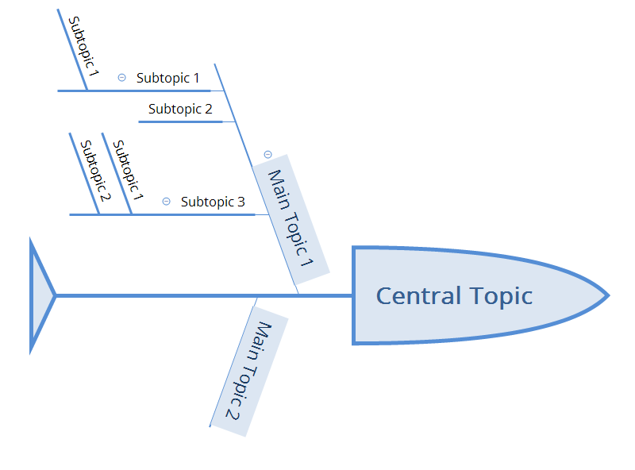
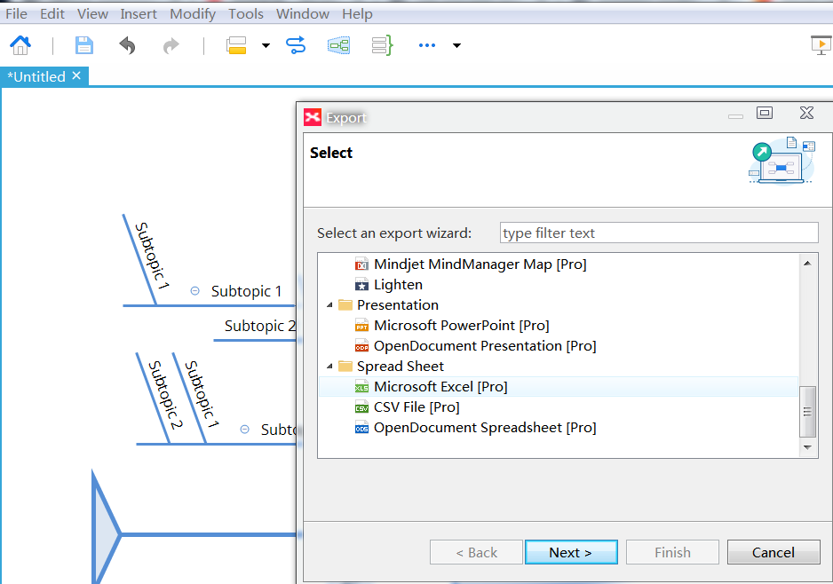
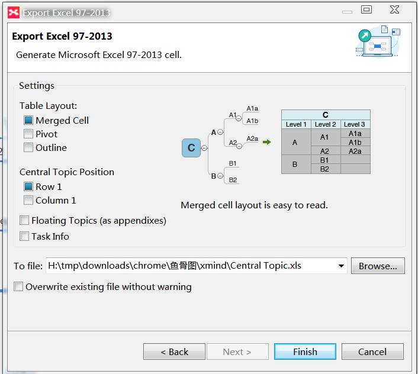
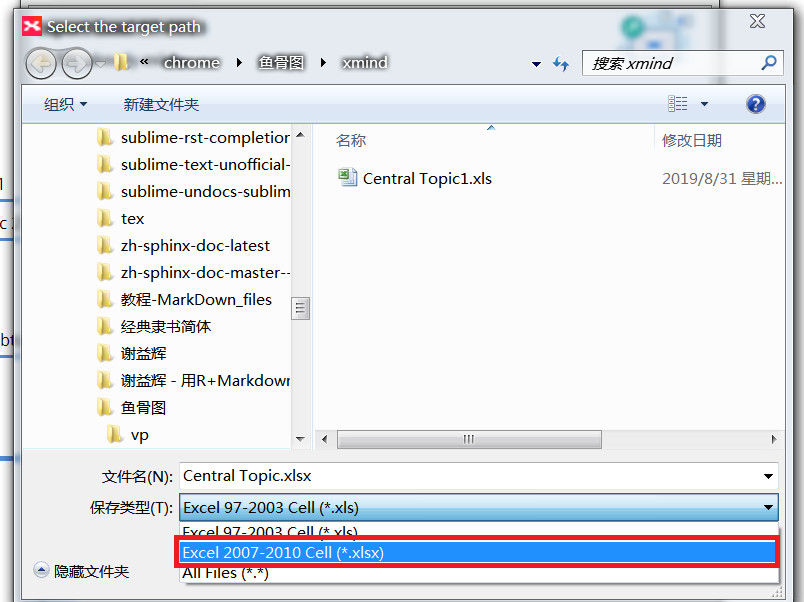
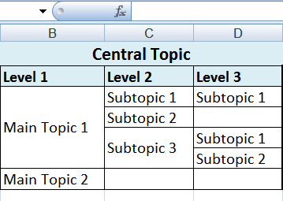
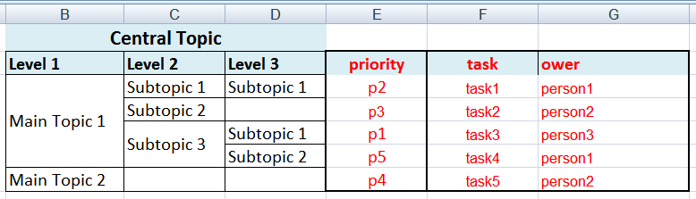
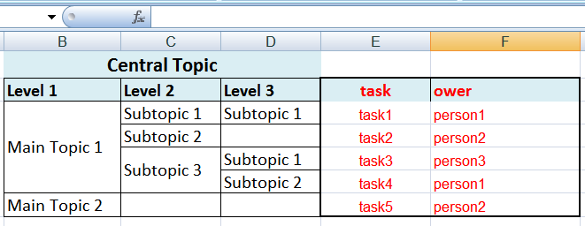

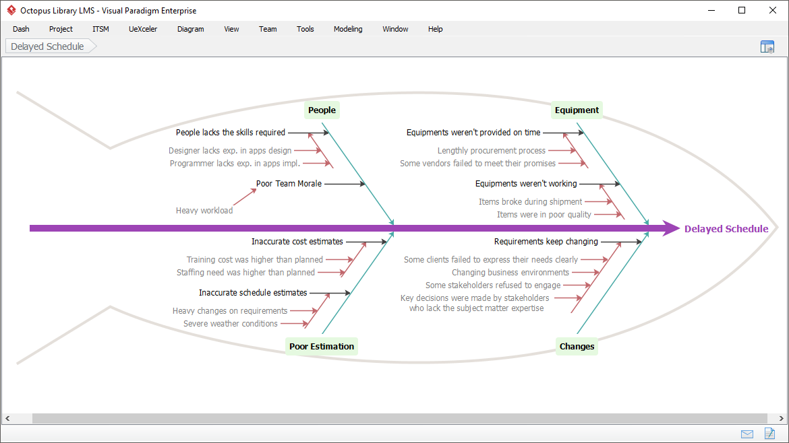
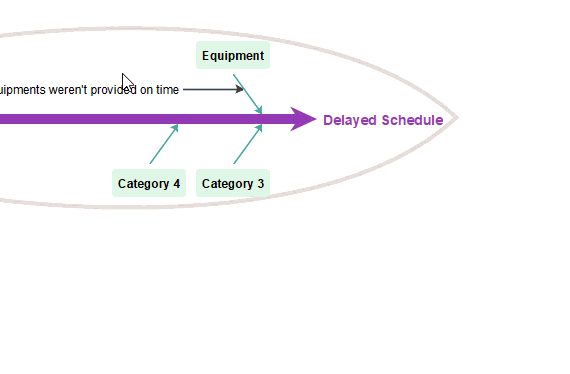

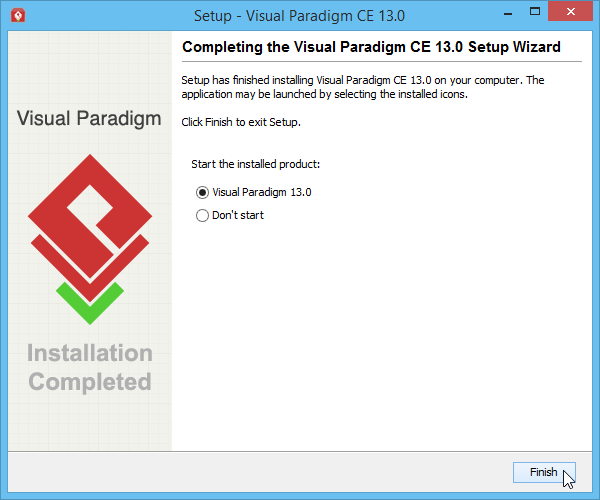
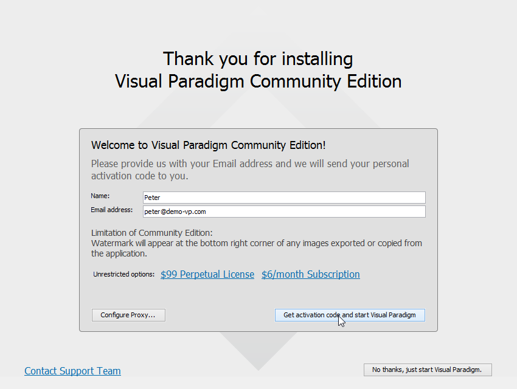
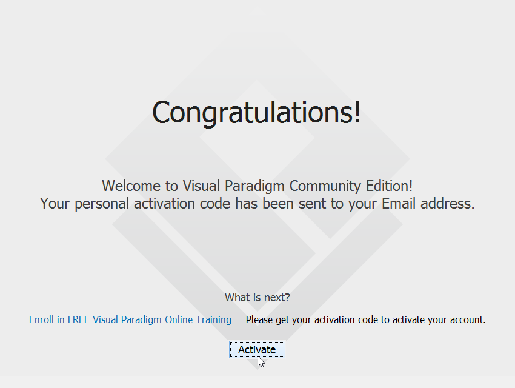
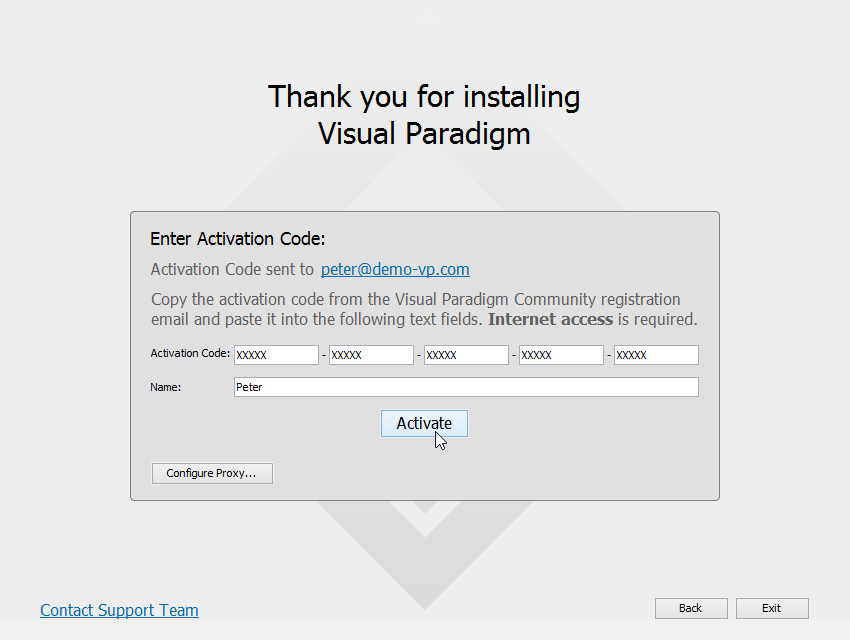
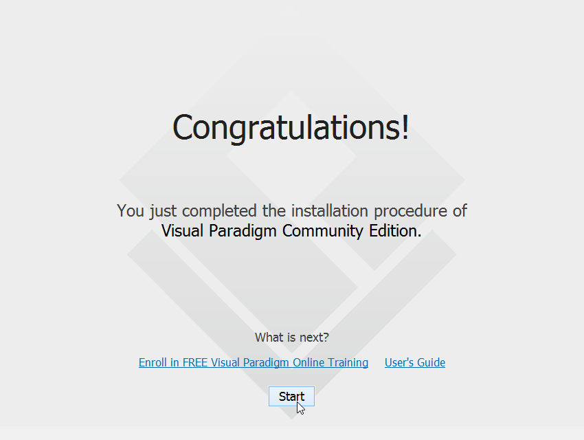